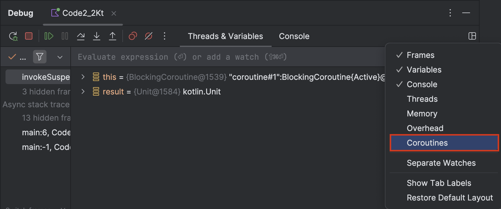

## 코루틴 기본 사용법
- runBlocking(): 
  - 호출한 스레드 점유 + 스코프 제공
  - 스코프 내에서 만들어진 모든 자식 코루틴(launch/async) 이 끝날 때까지 반드시 기다렸다가 리턴
- launch(): 
  - 결과값 없이 동시에 실행되는 코루틴을 시작. 필요하다면 Job으로 취소/완료 대기를 제어
```kotlin
import kotlinx.coroutines.*

fun main() = runBlocking {
    println("[${Thread.currentThread().name}] runBlocking 시작")

    launch {
        delay(1000) // suspend (스레드 블로킹 X)
        println("[${Thread.currentThread().name}] launch 실행")
    }

    println("메인 코루틴 종료 직전")
}
```

## 코루틴 디버깅

1. VM 옵션 추가
```text
-Dkotlinx.coroutines.debug
```
- 출력 예시
    ```text
    [main @coroutine#1] runBlocking 코루틴 실행
    [main @coroutine#2] launch 코루틴 실행
    ```
  
2. Intellij 디버깅 툴 
   - IntelliJ → Debug 탭 → **Coroutine 탭 활성화**

