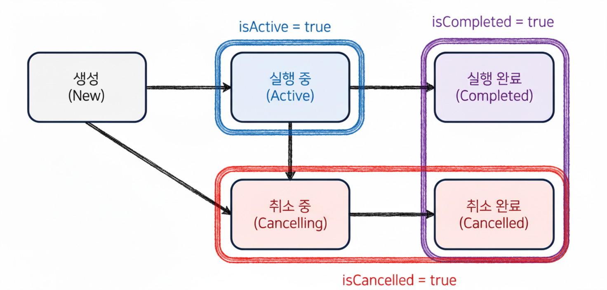

## 코루틴의 상태와 Job상태

| 상태 (State)     | 설명                                       | isActive | isCompleted | isCancelled |
| -------------- | ---------------------------------------- | -------- | ----------- | ----------- |
| **New**        | 코루틴 생성됨, 아직 시작 안함 (`CoroutineStart.LAZY`) | ❌        | ❌           | ❌           |
| **Active**     | 실행 중이거나 대기 중                             | ✅        | ❌           | ❌           |
| **Cancelling** | `cancel()` 호출됨, 정리(clean-up) 중           | ❌        | ❌           | ✅           |
| **Cancelled**  | 취소 완료된 상태                                | ❌        | ✅           | ✅           |
| **Completed**  | 정상 완료된 상태                                | ❌        | ✅           | ❌           |

### 예제
- 다음 예제의 출력값 예측할 수 있도록 공부하기
[status 폴더의 예제 보기](../src/main/kotlin/status/)
